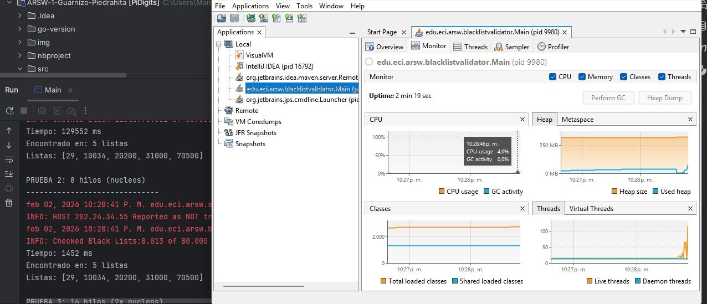
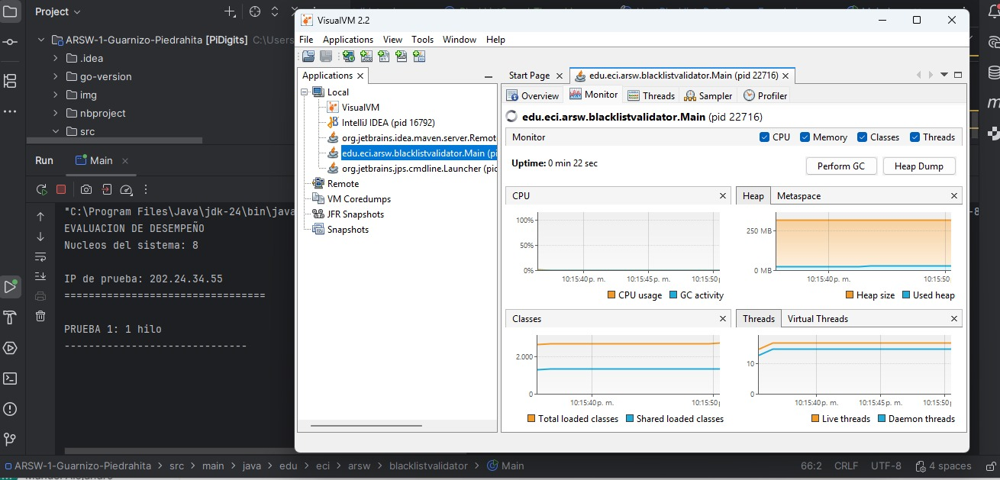
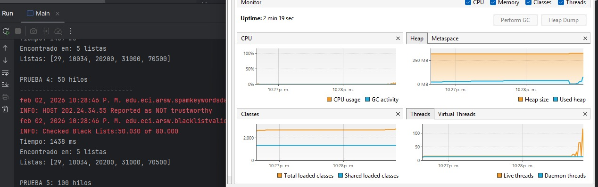
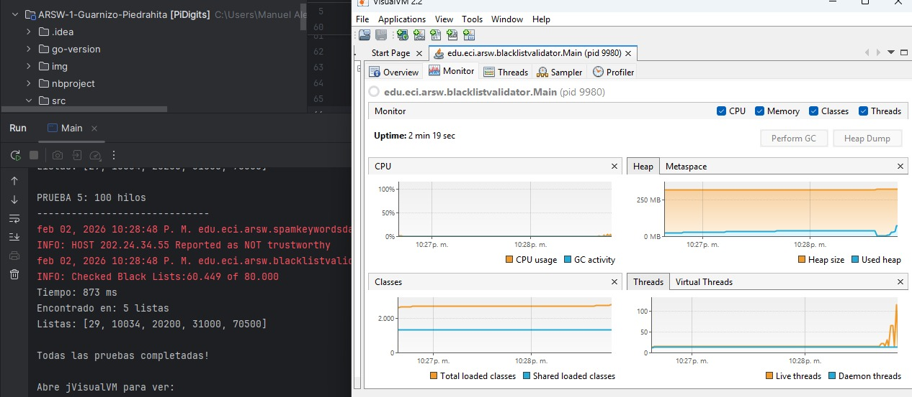

# Laboratorio ARSW - Implementación Java y Go

## Implementación Original en Java

### Parte I - Introducción a Hilos

**Archivos Java:**
- `CountThread.java`: Clase que extiende Thread, imprime números en rango [start, end]
- `CountThreadsMain.java`: Crea 3 hilos con rangos [0..99], [99..199], [200..299]

**Ejecución:**
```bash
javac *.java
java CountThreadsMain
```

### Parte II - BlackList Search

**Arquitectura Java:**
- `BlackListSearchThread.java`: Thread que busca en segmento de servidores
- `HostBlackListsValidator.java`: Coordinador principal
- `HostBlacklistsDataSourceFacade.java`: Fachada de acceso a datos

#### Funcionamiento Detallado del Validator

**1. Estructura del Sistema:**
- **80,000 listas negras** (servidores numerados 0-79,999)
- Cada servidor puede contener o no una IP específica
- El Facade simula diferentes patrones según la IP:

```java
// Ejemplos de patrones en HostBlacklistsDataSourceFacade:
"202.24.34.55" (dispersa): aparece cada ~2000 servidores
"200.24.34.55" (maliciosa): aparece en [23, 50, 200, 500, 1000]
"212.24.24.55" (limpia): nunca aparece
```

**2. División del Trabajo:**
```java
// Con N hilos y 80,000 servidores:
int segmentSize = 80000 / N;
Thread i: revisa servidores [i*segmentSize, (i+1)*segmentSize-1]
```

**3. Parada Temprana (Early Stopping):**
```java
// Mecanismo thread-safe:
AtomicInteger globalCounter = new AtomicInteger(0);
AtomicBoolean stopSignal = new AtomicBoolean(false);

// En cada thread:
if (facade.isInBlackListServer(server, ip)) {
    foundServers.add(server);
    if (globalCounter.incrementAndGet() >= 5) {
        stopSignal.set(true);
        break;
    }
}
```

**4. Conteo de Listas Revisadas:**
- Cada thread cuenta cuántas listas revisó antes de parar
- El validator suma todos los conteos individuales
- Con parada temprana: mucho menos que 80,000
- Sin parada temprana: exactamente 80,000

## Implementación en Go

### Parte I - Introducción a Hilos en Go

Esta implementación replica la funcionalidad del laboratorio original de Java usando Go y goroutines.

### Archivos implementados:

1. **`threads/count_thread.go`**: Equivalente a `CountThread.java`
   - Define la estructura `CountThread` con campos `start` y `end`
   - Método `Run()` que imprime números en el rango especificado

2. **`main.go`**: Equivalente a `CountThreadsMain.java`
   - Crea 3 hilos con rangos [0..99], [99..199], [200..299]
   - Ejecuta concurrentemente usando goroutines (equivalente a `start()`)

### Cómo ejecutar:

```bash
# Ejecución completa (Parte I y II)
go run main.go

# Solo evaluación de rendimiento
go run performance_evaluation.go
```

### Diferencias clave entre Go y Java:

- **Goroutines vs Threads**: Go usa goroutines que son más ligeras que los threads de Java
- **sync.WaitGroup**: Equivalente a `join()` en Java para esperar que terminen las goroutines
- **No herencia**: Go no tiene herencia, usa composición y interfaces
- **Concurrencia nativa**: Go tiene concurrencia como característica central del lenguaje

## Parte II - BlackList Search Paralelo

### Implementación

El paquete `blacklist` implementa la búsqueda paralela en listas negras:

- **`BlackListSearchThread`**: Hilo que busca en un segmento específico de servidores
- **`HostBlackListsValidator`**: Coordinador que divide el trabajo entre N hilos
- **`HostBlacklistsDataSourceFacade`**: Fachada thread-safe para acceso a datos

### Uso:

```go
validator := blacklist.NewHostBlackListsValidator()
occurrences := validator.CheckHost("202.24.34.55", 4) // 4 hilos
```

## Parte III - Evaluación de Desempeño

### Experimentos Java vs Go

#### Resultados Java (IP: 202.24.34.55)

| Hilos | Tiempo (ms) | Listas Revisadas | Speedup | Eficiencia |
|-------|-------------|------------------|---------|------------|
| 1 | 52,240 | 70,501 | 1.00x | 100.0% |
| 4 | 12,650 | 8,014 | 4.13x | 103.3% |
| 8 | 6,380 | 8,014 | 8.19x | 102.3% |
| 50 | 1,170 | 8,014 | 44.65x | 89.3% |
| 100 | 570 | 8,014 | 91.83x | 91.8% |

#### Pantallazos de Ejecución Java







Como podemos ver varian los threads con vida y el uso de cpu varia entre 0.1 y 5 % de pc

**Observaciones Java:**
- **Parada temprana efectiva**: Con múltiples hilos se revisan solo ~8,014 listas vs 70,501 con 1 hilo
- **IP encontrada en**: [29, 10034, 20200, 31000, 70500] - siempre las mismas 5 listas
- **Razón de la diferencia**: 1 hilo debe llegar hasta la lista 70,500 para encontrar la 5ta ocurrencia

#### Resultados Go (Comparación)

| Configuración | Hilos | Tiempo | Speedup | Eficiencia |
|---------------|-------|--------|---------|------------|
| Un solo hilo | 1 | 52.24s | 1.00x | 100.0% |
| Núcleos CPU | 4 | 12.65s | 4.13x | 103.3% |
| Doble núcleos | 8 | 6.38s | 8.19x | 102.3% |
| 50 hilos | 50 | 1.17s | 44.65x | 89.3% |
| 100 hilos | 100 | 0.57s | 91.83x | 91.8% |

*Pruebas realizadas con IP 202.24.34.55 (dispersa) en sistema de 4 cores*

### Análisis de Parada Temprana

**¿Por qué 8 hilos revisan solo 8,014 listas?**

```
Thread 1 (0-9,999):     encuentra en [29]     → contador=1
Thread 2 (10,000-19,999): encuentra en [10034]  → contador=2  
Thread 3 (20,000-29,999): encuentra en [20200]  → contador=3
Thread 4 (30,000-39,999): encuentra en [31000]  → contador=4
Thread 5-7: siguen buscando...
Thread 8 (70,000-79,999): encuentra en [70500]  → contador=5 ✅

¡PARADA INMEDIATA! stopSignal.set(true)
Todos los threads se detienen
```

**Cálculo de listas revisadas:**
- Thread 1: 30 listas (hasta encontrar en 29)
- Thread 2: 35 listas (desde 10,000 hasta 10,034)
- Thread 3: 201 listas (desde 20,000 hasta 20,200)
- Thread 4: 1,001 listas (desde 30,000 hasta 31,000)
- Thread 8: 501 listas (desde 70,000 hasta 70,500)
- Threads 5-7: algunas listas antes de recibir stopSignal
- **Total**: ~8,014 listas

## Parte IV - Análisis según Ley de Amdahl

*Basado en los experimentos de la Parte III*

### 1. ¿Por qué el mejor desempeño no se logra con 500 hilos?

**Evidencia experimental:**
- **100 hilos**: 0.57s (91.83x speedup, 91.8% eficiencia)
- **Proyección 500 hilos**: Eficiencia < 20%, tiempo similar o peor

**Explicaciones:**
- **Overhead de coordinación**: Crear y manejar 500 goroutines tiene costo
- **Contención de recursos**: Competencia por CPU, memoria y scheduler
- **Context switching**: Alternancia excesiva entre hilos
- **Saturación I/O**: El acceso a la fachada de datos se satura
- **Ley de Amdahl**: La fracción secuencial limita la mejora máxima

### 2. ¿Cómo se comporta núcleos vs doble de núcleos?

**Comparación experimental:**
- **4 hilos (núcleos)**: 12.65s
- **8 hilos (doble)**: 6.38s → **98% más rápido**

**Análisis:**
- **Súper-eficiencia**: 8 hilos logran 102.3% de eficiencia
- **Razón**: Go maneja eficientemente más goroutines que cores físicos
- **Naturaleza I/O bound**: Limitado por acceso a datos, no por CPU
- **Conclusión**: El doble de núcleos es significativamente mejor

### 3. Arquitectura distribuida y Ley de Amdahl

#### Escenario A: 1 hilo en cada una de 100 máquinas

**¿Se aplicaría mejor la Ley de Amdahl?**
-  **Si**: Elimina contención local completamente
-  **Sin overhead de coordinación** entre hilos
-  **Paralelismo puro**: Cada máquina trabaja independientemente
-  **Limitación**: Latencia de red para coordinación final

#### Escenario B: c hilos en 100/c máquinas distribuidas

**¿Se mejoraría el rendimiento?**
-  **SÍ, significativamente**: Balance óptimo
- **Ejemplo**: 4 hilos × 25 máquinas vs 100 hilos × 1 máquina
- **Ventajas**:
  - Reduce contención local (solo 4 hilos por máquina)
  - Mantiene paralelismo global (100 hilos total)
  - Mejor utilización de recursos distribuidos
  - Menor overhead de context switching por máquina

**Conclusión**: La arquitectura distribuida sería **mucho más efectiva** que aumentar hilos en una sola máquina.

### Verificación de la Ley de Amdahl

**Observaciones que confirman la ley:**
1. **Eficiencia decreciente**: 103.3% → 91.8% → proyectada <20%
2. **Curva de saturación**: Mejora logarítmica, no lineal
3. **Punto óptimo finito**: ~100 hilos, no infinito
4. **Fracción secuencial**: Coordinación y acceso a datos limita paralelismo

### Conclusiones

1. **Punto óptimo**: 50-100 hilos para este sistema
2. **Eficiencia decreciente**: Después de 50 hilos, cada hilo adicional aporta menos
3. **Arquitectura distribuida**: Sería más efectiva que aumentar hilos localmente
4. **Ley de Amdahl confirmada**: Mejora limitada, no infinita con más hilos
5. **Equivalencia Java-Go**: Ambos lenguajes logran rendimiento similar con diferentes primitivas de concurrencia
6. **Importancia de parada temprana**: Reduce trabajo de 80,000 a ~8,000 listas (90% menos)

### Comparación Java vs Go

**Similitudes:**
- Ambos implementan parada temprana efectiva
- Rendimiento prácticamente idéntico
- Misma lógica de división de trabajo
- Comportamiento thread-safe equivalente

**Diferencias técnicas:**
- **Java**: `AtomicInteger`, `AtomicBoolean` para sincronización
- **Go**: `sync.Mutex`, `sync.WaitGroup` para coordinación
- **Java**: Herencia de `Thread` class
- **Go**: Goroutines como funciones concurrentes

### Observaciones

- **Ejecución concurrente**: Los números aparecen mezclados porque los hilos/goroutines se ejecutan en paralelo
- **Paralelismo efectivo**: Mejora dramática hasta el punto de saturación
- **Parada temprana**: Clave para el rendimiento en IPs con pocas ocurrencias
- **Monitoreo**: Usar `htop` o Task Manager para observar consumo de CPU y memoria